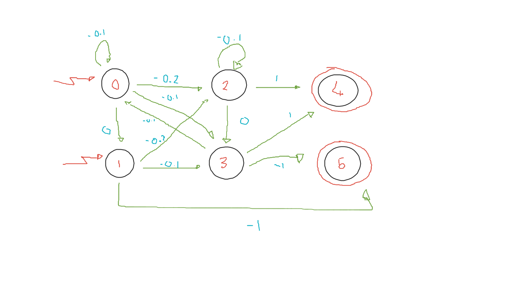

# SimpleEnv
A simple MDP Gym environment


Actions are counted clockwise.

State space: One hot vector, length = 6

Action space: Discrete(3)

## Installation
```
git clone https://github.com/will-maclean/SimpleEnv.git
cd SimpleEnv
pip install -e .
```

## Usage

```python
import gym

env = gym.make("SimpleEnv/SimpleEnv-v0")

state = env.reset()
action = env.action_space.sample()
next_state, reward, done, info = env.step(action)
```
